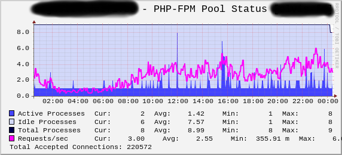

Cacti PHP-FPM template
======================

[Cacti](http://www.cacti.net/) graph template for [FastCGI Process Manager (FPM)](http://php.net/manual/en/install.fpm.php).

Requires PHP 5.3.8+ for older versions you may need to [tweak](http://forums.cacti.net/viewtopic.php?p=216341#p216341) field names.

The status can be retrieved from PHP-FPM via HTTP or FCGI protocol.

Draws graphs for 4 items and total request count:
- Active - active processes count
- Idle - current idle processes count
- Total - current total process count
- Requests/sec - average
- Total requests - accepted connections

Originally imported from cacti forum posts: http://forums.cacti.net/viewtopic.php?f=12&t=41580

